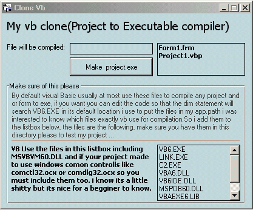



## Vb Clone

### Description

Vb clone, as the name say ,this project is a clone of visual basic and it will compile any form or project file to exe, the process is very easyý and lame somehow, please read the builtin dialog small documentation to obtain some usefull information about vb and how it compile any form or project to exe ... You find this usefull?? drope me a vote :)
 
### More Info
 

             |
---                |---
**Submitted On**   |2003-05-29 12:43:10
**By**             |[kegham](https://github.com/Planet-Source-Code/PSCIndex/blob/master/ByAuthor/kegham.md)
**Level**          |Beginner
**User Rating**    |3.4 (31 globes from 9 users)
**Compatibility**  |VB 5\.0, VB 6\.0
**Category**       |[Files/ File Controls/ Input/ Output](https://github.com/Planet-Source-Code/PSCIndex/blob/master/ByCategory/files-file-controls-input-output__1-3.md)
**World**          |[Visual Basic](https://github.com/Planet-Source-Code/PSCIndex/blob/master/ByWorld/visual-basic.md)
**Archive File**   |[Vb\_Clone1593765292003\.zip](https://github.com/Planet-Source-Code/kegham-vb-clone__1-45798/archive/master.zip)

